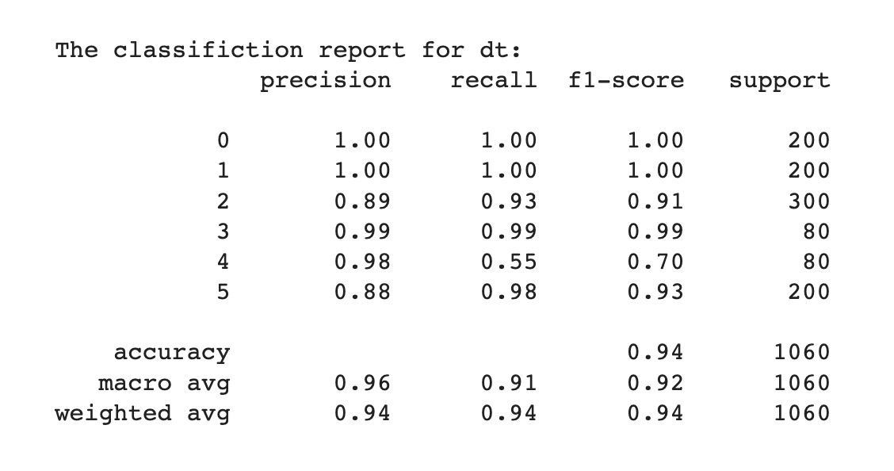
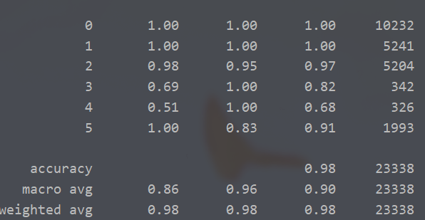

# Welcome to the algorithm group North Star!

## Team Arrangement

* **Wen Xueru**: Project Manager & Liaison & Tester

* **Dong Jin**: System Architect & Programmer

* **Zhou Changjiang**: Requirement Analyst & Programmer

## Hiring:

We welcome you to join our team if you are interested in **algorithms**.

We expect you to understand the basics of **machine learning** and to be able to use **Python** and the **Pytorch** framework.

### Contact: wenxr2119@mails.jlu.edu.cn

### Contact: 2577273670@qq.com

## 3.30 Progress achieved

### Requirement Analysis

- The server or potential platform user intend to pretrain the model for common people and further user-specified fine-tune process.
- The server or potential platform user wants to change the model to make it the most suitable model for his or her.
- The server or potential platform user wants to predict the future mode of the user.
- The server or potential platform user intends to switch the scene to adapt to the requirements of specific scenarios.
- The server or potential platform user intends to select the algorithm to achieve the desired effect.

### Rapid prototyping model

- **Classification**

  we use the **Decision Tree** algorithm to Implement the function of classification.

  

## 4.13 Progress achieved

### System Design

Here is the [system design documents](documents).

## 4.17 Progress achieved

### Rapid prototyping model

Macro-F1 reach 98.3% under the GRU network.

## 4.20 Progress achieved

### Tentative implement

Macro-F1 reach 98.0% with separated datasets.

Speed up the IO by transforming data format into csv.



## 4.26 Progress achieved

### Tentative implement of interface.

## 4.26 Progress achieved

### Rough implement of interface.

### Simple unitest.

### Solve the failure on the evaluation by set large window_size.

## 5.11 Progress achieved

### Involved in integral test.

## 5.18 Progress achieved

### Implementation for multiple algorithms, including **SVM**,  **KNN**, NaiveBayes, DecisionTree

### Update the interface to the latest version.

All experiments is conducted in a **1/10 down-sample strategy** as **memory overflow** could be brought about when transfering all data.

#### SVM

              precision    recall  f1-score   support
    
           0       1.00      1.00      1.00      5422
           1       1.00      1.00      1.00      5407
           2       0.78      0.99      0.87      5615
           3       0.92      1.00      0.95       489
           4       0.89      0.90      0.89       494
           5       0.00      0.00      0.00      1549
    
    accuracy                           0.91     18976
    macro avg      0.76      0.81      0.79     18976
    weighted avg   0.85     0.91       0.88     18976


#### KNN

              precision    recall  f1-score   support
    
           0       1.00      1.00      1.00      5422
           1       0.82      1.00      0.90      5407
           2       1.00      0.25      0.40      5615
           3       0.16      0.93      0.27       489
           4       0.13      0.73      0.22       494
           5       0.00      0.00      0.00      1549
    
    accuracy                           0.69     18976
    macro avg 	   0.52      0.65      0.47     18976
    weighted avg   0.82      0.69      0.67     18976


#### NaiveBayes

              precision    recall  f1-score   support
    
           0       1.00      1.00      1.00      5422
           1       1.00      0.98      0.99      5407
           2       0.94      0.94      0.94      5615
           3       0.77      1.00      0.87       489
           4       0.43      0.44      0.44       494
           5       1.00      0.97      0.98      1549
    
    accuracy                           0.96     18976
    macro avg 	   0.86      0.89      0.87     18976
    weighted avg   0.96      0.96      0.96     18976


#### DecisionTree

              precision    recall  f1-score   support
    
           0       1.00      1.00      1.00      5422
           1       0.00      0.00      0.00      5407
           2       0.41      0.75      0.53      5615
           3       0.69      0.66      0.67       489
           4       0.19      0.92      0.31       494
           5       0.49      0.08      0.14      1549
    
    accuracy                           0.56     18976
    macro avg 	  0.46       0.57      0.44     18976
    weighted avg  0.47       0.56      0.48     18976

### RandomForest

              precision    recall  f1-score   support
    
           0       1.00      1.00      1.00      5422
           1       0.00      0.00      0.00      5407
           2       0.40      0.71      0.51      5615
           3       0.82      1.00      0.90       489
           4       0.17      1.00      0.29       494
           5       0.00      0.00      0.00      1549
    
    accuracy                           0.55     18976
    macro avg	   0.40      0.62      0.45     18976
    weighted avg   0.43      0.55      0.47     18976


### 5.20 ProgressAchieved

We have implemented the integrated  voter model of 10 Naive Bayes, of which the results (**as follows**) indicate that transfering all data performs no better than sampling 1/10 of the data. Therefore for all **machine learning** methods employ a **1/10 down-sampling** strategy in terms of efficiency. Note that luckily the **deep learning** methods won't be faced with the dilemma due to the **mini-batch training strategy**.

```
              precision    recall  f1-score   support

           0       1.00      1.00      1.00      5422
           1       1.00      0.98      0.99      5407
           2       0.94      0.94      0.94      5615
           3       0.78      1.00      0.88       489
           4       0.44      0.43      0.43       494
           5       1.00      0.97      0.98      1549

    accuracy                           0.96     18976
   macro avg       0.86      0.89      0.87     18976
weighted avg       0.96      0.96      0.96     18976
```

 
