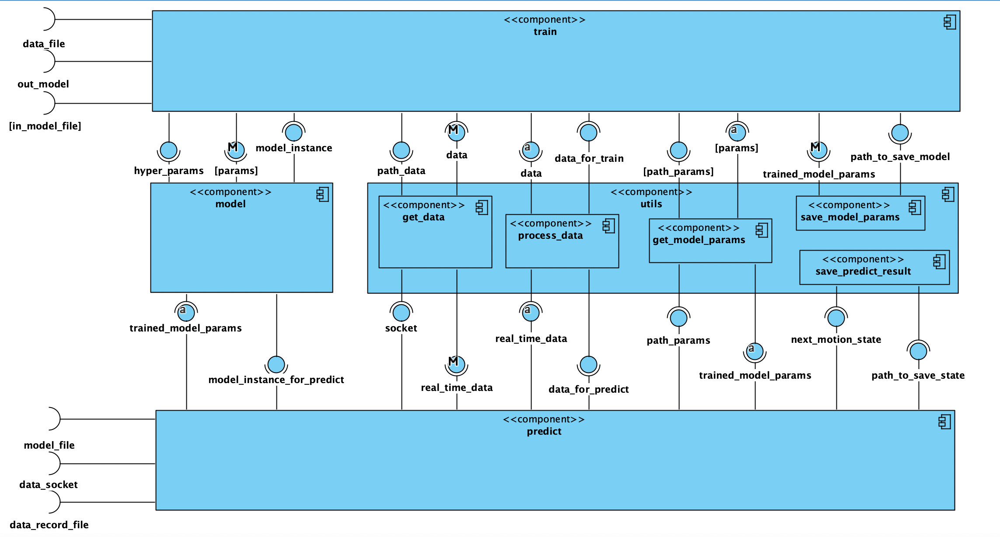

# Software Design Specification (SDS)

Revision History:

<!--
The server and client documents should be combined into one for a single project
-->

| Date   | Author      | Description            |
|--------|-------------|------------------------|
| Apr 7  | Xiaoquan XU | Converted the template |
| Apr 10 | DONG Jin    | the first version      |
| Apr 29 | Wen Xueru   | fine tine              |
|        |             |                        |
|        |             |                        |
|        |             |                        |

## Architecture

### \<Component Diagram\>

Component Diagram (CD) specifies how the system is parted according to the use cases analyzed from RS.

